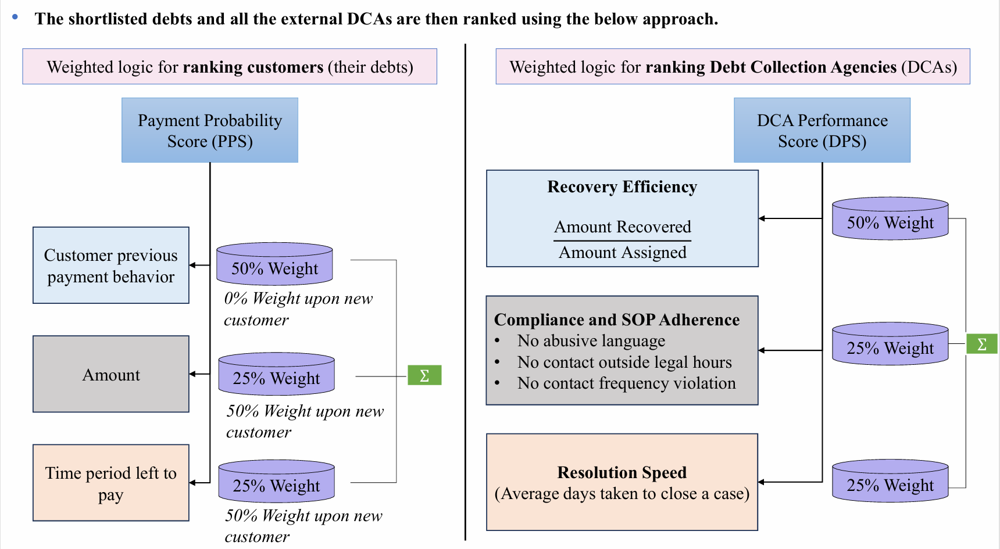

**DigiRecoverer**

Enterprise-Grade Intelligent Debt Collection & Governance Platform

Developed for FedEx SMART Hackathon | Team Synergy

**Executive Summary**:

DigiRecoverer is an end-to-end digital ecosystem designed to replace the manual, opaque, and fragmented processes of managing external Debt Collection Agencies (DCAs).
Addressing the critical challenges of delayed recoveries, weak governance, and limited scalability, DigiRecoverer leverages Artificial Intelligence, Predictive Scoring, and Process Automation to bridge the gap between FedEx Enterprise teams and external agencies.

**Value Proposition:** By automating debt segmentation and prioritizing cases based on AI probability scores, DigiRecoverer aims to save significant amount of firm's costs while ensuring strict SLA compliance and data security.

The system follows a scalable, multi-tier architecture designed to integrate seamlessly with existing Finance ERPs.

**System Architecture:**

**1. Automated shortlisting of debts:**

• To overcome manual excel uploads for shortlisting debts; we have incorporated APIs and Data Feed which were 
linked to Finance ERP (Accounts Receivable module) and Billing / Invoicing systems of FedEx.

• AI driven bot (robot) can be directly integrated into the legacy systems to fetch invoice details.

**• Debt shortlisting criteria:**

• Overdue beyond configured grace period

• Net outstanding amount > threshold

• Payment promise breached

• No dispute / legal / compliance hold / no active collection

**2. The Intelligence Core (Scoring Engine)**

Once shortlisted, data is passed through our dual-scoring engine to determine the optimal recovery strategy.

Logic A: Customer Ranking (PPS): Quantifies the likelihood of a customer paying.

Logic B: Agency Ranking (DPS): Quantifies which Agency is best suited for the job.

**3. Strategic Branching & Allocation**

The system makes autonomous decisions based on the Payment Probability Score (PPS) :

**High PPS (90-100%):** The system bypasses DCAs entirely, sending automated messages embedded with hyper-personalized digital payment links to the customer. **Outcome:** Saves agency (10-20)% commission fees.

**Mid-to-Low PPS:** Cases are routed to DCAs. The specific DCA is chosen based on their Tier (1, 2, or 3), ensuring difficult cases go to top-performing agencies.

**4. The Governance Layer**

**Real-time Write-back:** Payments received are immediately updated in the FedEx AR module to prevent harassment of customers who have already paid .

**SLA Monitoring:** Proactive tracking of abusive language, contact frequency, and resolution speed.

**5. Predictive Analysis**

**Pro-active monitoring:** Redirecting to higher-level DCAs based on case progress.

and many more...

**Contrast: Current V/S our Proposed framework**

**Results:**

------------------------------------------------------------------------------------------------------------------------------------------------

------------------------------------------------------------------------------------------------------------------------------------------------

------------------------------------------------------------------------------------------------------------------------------------------------

------------------------------------------------------------------------------------------------------------------------------------------------

------------------------------------------------------------------------------------------------------------------------------------------------
**Instructions to run the code:**

1. Activate the environment : .venv\Scripts\Activate
2. Open 3 terminals - Frontend, Backend, SMTP Server
3. To activate Frontend :
   
    3.1 cd frontend
   
    3.2 npm start
5. To activate Backend :
    
    4.1 cd backend
   
    4.2 python run.py
7. To run the SMTP Server : python -m smtpd -n -c DebuggingServer localhost:1025
